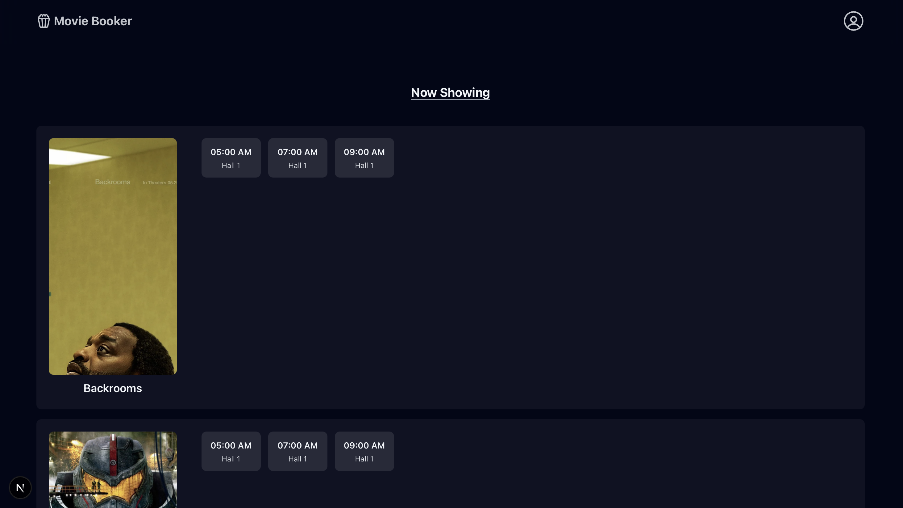
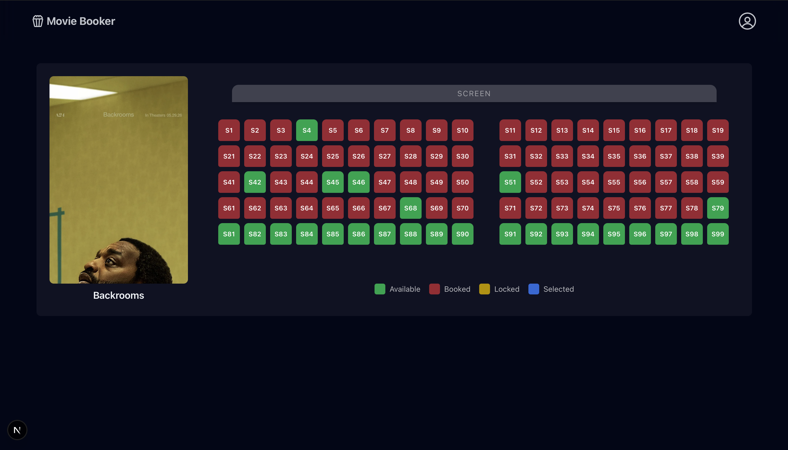
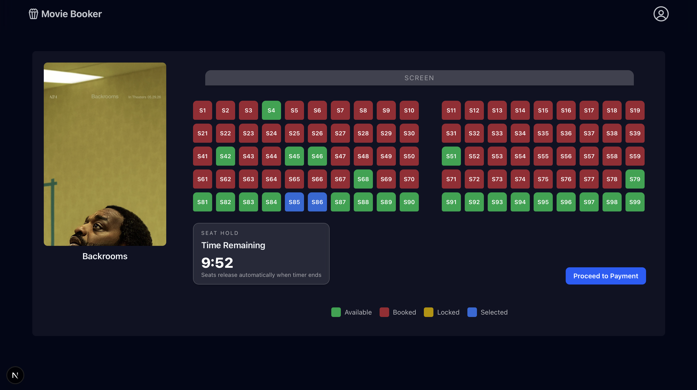
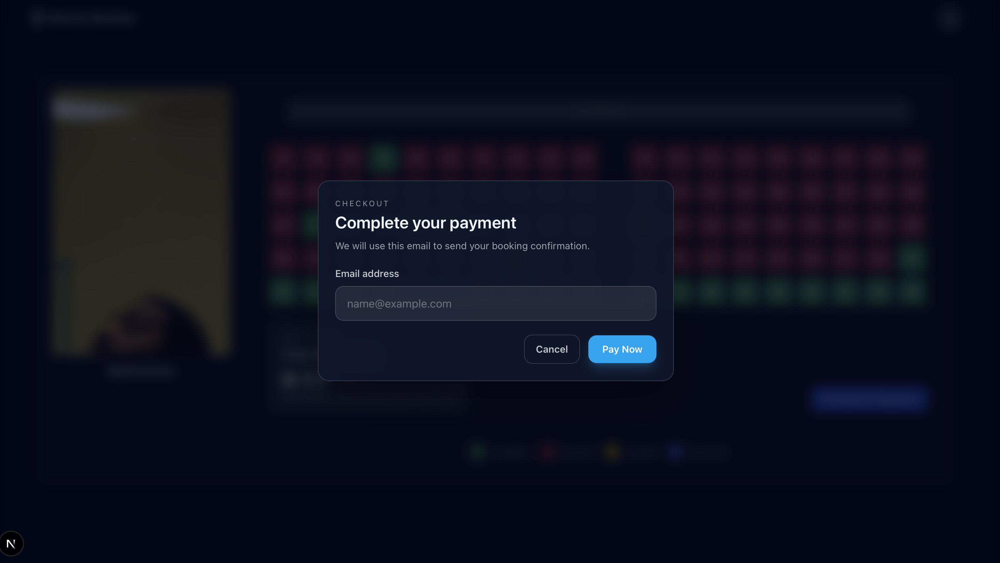

# MovieBooker

A full-stack cinema booking application engineered to handle high-concurrency ticketing scenarios. It manages the complete reservation flow, utilizing a Go-based API, Redis for distributed session locking, and PostgreSQL for ACID-compliant persistence.

The architecture is specifically designed to guarantee data integrity during traffic spikes by preventing double-booking and double-charging race conditions.

## Screenshots


<p align="center"><sub>Figure 1. Home page</sub></p>


<p align="center"><sub>Figure 2. Showtime page</sub></p>


<p align="center"><sub>Figure 3. Seat hold</sub></p>


<p align="center"><sub>Figure 4. Payment page</sub></p>

## Features

### Core Features
#### Concurrency Control (Zero Double-Bookings)
The system uses a two-tiered locking strategy to guarantee a seat is never sold twice:
- Optimistic Soft-Locking (Redis): When a user selects a seat, a temporary TTL-bound lock is created via SETNX. Atomic Lua scripts validate lock ownership and extend TTLs during the checkout phase, automatically releasing seats back to the pool if the session expires.
- Pessimistic Hard-Locking (PostgreSQL): During the final payment transaction, the database executes a SELECT ... FOR UPDATE query. This enforces row-level locks, acting as a final fail-safe against concurrent data mutations before the booking is permanently committed.

#### Idempotent Payment Flow (Zero Double-Charges)
Network failures and rapid retry clicks are handled safely through API idempotency:
- State Tracking (Redis): Every payment request requires a unique Idempotency-Key. The system immediately caches this key with a "processing" state.
- Concurrency Rejection: Subsequent requests with the same key while the first is processing are instantly rejected (409 Conflict), preventing simultaneous charges.
- Safe Retries: If a payment succeeds, the transaction payload is cached. If the client retries, the API safely returns the cached success response without re-triggering the payment or database mutation.


### Overall Features

- Browse a catalog of movies and their available showtimes
- View an interactive seat map with visual seat states
- Temporarily hold seats in a user session with automatic expiry
- Use optimistic UI updates for seat selection and release actions
- Complete a mock payment flow with idempotency protection
- Prevent double-booking race conditions using Redis distributed locks and PostgreSQL transactions
- NOTE: No email service is attached to this application

## Tech Stack

### Frontend
- Next.js 16
- TanStack React Query

### Backend
- Golang
- Gin web framework
- PostgreSQL with `pgx`
- Redis with `go-redis`

### Testing and tooling
- k6 for load testing

## Setup and Run

### Prerequisites
- Go 1.26+
- Node.js 20+
- Docker Desktop or Docker Engine with Docker Compose

### Backend (Docker Compose)

- Start up Go API, Redis and Postgres
- Creates Table and Insert Movies and Showtimes

```bash
docker compose up --build
```

Services started by Compose:
- Backend API: http://localhost:8080
- PostgreSQL: localhost:5432
- Redis: localhost:6379

To stop the stack:

```bash
docker compose down
```

To reset the local PostgreSQL volume and re-run the seed script:

```bash
docker compose down -v
docker compose up --build
```

### Frontend

```bash
cd frontend
npm install
npm run dev
```

Open http://localhost:4000 to use the app.

### Testing Locally

#### Double Booking Test
This test simulate 100 concurrent users trying to lock the same seat 
```bash
k6 run -e SEAT_ID=30 -e SHOWTIME_ID=1 tests/load/double-booking.js
```

#### Double Payment Test
This test simulate 50 instances of the same user paying for a seat
```bash
k6 run -e SEAT_ID=91 -e SHOWTIME_ID=1 tests/load/double-payment.js
```

#### Load Test
The test mimics a sudden wave of traffic using a ramping Virtual User (VU) model over 50 seconds
```bash
k6 run -e SHOWTIME_ID=1 -e MIN_SEAT_ID=1 -e MAX_SEAT_ID=100 tests/load/end-to-end.js
```

## Architecture

1. Frontend
   - The Next.js app renders the movie catalog and seat selection experience.
   - React Query manages async state and optimistically updates seat UI when users lock or unlock seats.
   - Manages multi-seat booking sessions with a live countdown timer to enforce temporary holds.

2. API Layer
   - The Go backend exposes REST endpoints for catalog browsing, seat retrieval, seat locking/unlocking, and payment.
   - The API uses Gin for request handling and middleware.

3. Data Layer
   - PostgreSQL stores the movies, seat availabilities and booking records
   - Redis stores short-lived seat locks, session cart state, and idempotency keys.

4. Booking Flow
   - A user requests seats and the backend marks them as selected in the session.
   - A payment request validates the locks, extends their TTL, and commits a booking transaction in PostgreSQL.
   - Redis is then cleaned up and the seat availability cache is invalidated.

## API Endpoints

### 1. GET /api/catalog

#### Definition
- Method: `GET`
- Path: `/api/catalog`
- Description: Retrieve all movies and their showtimes
- Authentication: None

#### Request
- Headers: None
- Path Parameters: None
- Query Parameters: None
- Body: None

#### Behavior
- The backend first tries to read the catalog from Redis.
- If the cache is empty, it queries PostgreSQL and caches the result.

#### Limitation
- Thundering Herd: if many users hit the same cache miss, multiple requests can query PostgreSQL at once.
  - This was intentionally left out of scope for this project.
  - A common mitigation is single-flight cache hydration so one request populates cache while others wait.

#### Response
- Status: 200 OK

```json
[
  {
    "id": 1,
    "title": "Movie Title Here",
    "poster_url": "https://example.com/poster.jpg",
    "showtimes": [
      {
        "id": 101,
        "movie_id": 1,
        "starts_at": "2026-07-26T20:00:00Z",
        "hall": "Hall A"
      },
      {
        "id": 102,
        "movie_id": 1,
        "starts_at": "2026-07-26T23:30:00Z",
        "hall": "Hall B"
      }
    ]
  }
]
```

#### Error Handling
- 500 Internal Server Error if PostgreSQL fails or the returned data cannot be mapped correctly.

---

### 2. GET /api/booking/showtimes/:showtime_id/seats

#### Definition
- Method: `GET`
- Path: `/api/booking/showtimes/:showtime_id/seats`
- Description: Retrieve seat availability for a specific showtime and session TTL
- Authentication: None

#### Request
- Headers: `X-Session-ID`
- Path Parameters: `showtime_id`
- Query Parameters: None
- Body: None

#### Behavior
- The backend loads the seat layout from Redis if available; otherwise it queries PostgreSQL and caches the result.
- It then checks for temporary Redis seat locks and marks seats as:
  - available
  - locked
  - selected
  - booked

#### Limitation
- Thundering Herd: if many users hit the same cache miss, multiple requests can query PostgreSQL at once.
  - This was intentionally left out of scope for this project.
  - A common mitigation is single-flight cache hydration so one request populates cache while others wait.

#### Response
- Status: 200 OK

```json
{
  "seats": [
    {
      "id": 1,
      "showtime_id": 101,
      "label": "A1",
      "status": "available"
    },
    {
      "id": 2,
      "showtime_id": 101,
      "label": "A2",
      "status": "locked"
    },
    {
      "id": 3,
      "showtime_id": 101,
      "label": "A3",
      "status": "selected"
    },
    {
      "id": 4,
      "showtime_id": 101,
      "label": "A4",
      "status": "booked"
    }
  ],
  "expires_at": 1785074694
}
```

- `seats`: full seat layout with computed status per seat.
- `expires_at` (optional): UNIX timestamp (seconds) for when the current session hold expires. Omitted when there is no active hold for this session.

#### Error Handling
- 400 Bad Request if the showtime ID or session header is missing
- 500 Internal Server Error if the DB or Redis lock lookup fails

---

### 3. POST /api/booking/showtimes/:showtime_id/seats/:seat_id/lock

#### Definition
- Method: `POST`
- Path: `/api/booking/showtimes/:showtime_id/seats/:seat_id/lock`
- Description: Temporarily hold a seat for the current session
- Authentication: None

#### Request
- Headers: `X-Session-ID`
- Path Parameters: `showtime_id`, `seat_id`
- Query Parameters: None
- Body: None

#### Behavior
- The backend uses Redis SETNX to perform a fast soft lock.
- It also checks PostgreSQL to ensure the seat is still available before committing the lock.
- If the lock succeeds, the seat is added to the session cart and the TTL is extended.  

#### Limitation
- Non-atomic lock + session write: SETNX and SADD + EXPIREAT are separate operations.
  - A crash between them can leave an orphaned soft lock until TTL expiry.
  - Seat availability hard-check still queries PostgreSQL on lock attempts.

#### Response
- Status: 200 OK


#### Error Handling
- 400 Bad Request if required parameters are missing
- 409 Conflict if the seat is already locked or no longer available
- 500 Internal Server Error if Redis or PostgreSQL fails

---

### 4. POST /api/booking/showtimes/:showtime_id/seats/:seat_id/unlock

#### Definition
- Method: `POST`
- Path: `/api/booking/showtimes/:showtime_id/seats/:seat_id/unlock`
- Description: Release a previously locked seat for the current session
- Authentication: None

#### Request
- Headers: `X-Session-ID`
- Path Parameters: `showtime_id, seat_id`
- Query Parameters: None
- Body: None

#### Behavior
- The backend uses a Lua script in Redis to atomically verify ownership, delete the seat lock, and remove the seat from the session set.

#### Response
- Status: 200 OK

#### Error Handling
- 400 Bad Request if required parameters are missing
- 403 Forbidden if another session owns the lock
- 404 Not Found if the lock is missing or expired
- 500 Internal Server Error if the Lua script fails

---

### 5. POST /api/payment/pay

#### Definition
- Method: `POST`
- Path: `/api/payment/pay`
- Description: Finalize payment for seats held in the current session
- Authentication: None

#### Request
- Headers: `Idempotency-Key`, `X-Session-ID`
- Path Parameters: None
- Query Parameters: None
- Body:
  - `email`
  - `showtime_id`

#### Behavior
- The endpoint uses Redis to create an idempotency key and prevent duplicate processing.
- It validates the session and the seat locks, extends the TTL, and simulates payment processing.
- It then performs a PostgreSQL transaction to insert a booking and mark seats as booked.
- Redis locks and session state are cleaned up after a successful payment.

#### Limitation
- Synchronous blocking: the mock payment delay blocks a goroutine for around 2 seconds per payment attempt.
- Refund simulation is simplified; there is no full downstream refund workflow.
- Idempotency depends on Redis durability; if Redis is flushed, the same idempotency key could be retried.
  - Though checking of the 'booked' seat status will prevent repayment

#### Response
- Status: 200 OK

```json
{
  "booking_id": "a1b2c3d4-e5f6-7890-1234-56789abcdef0",
  "showtime_id": "st_12345",
  "seat_ids": [42, 43, 44]
}
```

#### Error Handling
- 400 Bad Request if headers or the JSON body are invalid
- 402 Payment Required if the mock payment gateway rejects the charge
- 409 Conflict if the payment is already processing, the session is expiring, or the seat locks are invalid
- 500 Internal Server Error if Redis or PostgreSQL fails during processing

---

### 6. POST /api/admin/catalog

#### Definition
- Method: `POST`
- Path: `/api/admin/catalog`
- Description: Add a new movie along with exactly 5 showtimes. The system will automatically generate 100 seats (labeled S1 to S100) for each of the showtimes.
- Authentication: `Bearer <ADMIN_API_KEY>`

#### Request
- Headers: `Authorizaton: Bearer <ADMIN_API_KEY`
- Path Parameters: None
- Query Parameters: None
- Body:
```json
{
  "title": "Inception",
  "poster_url": "https://example.com/poster.jpg",
  "showtimes": [
    {
      "starts_at": "2026-07-31T13:00:00Z",
      "hall": "Hall 1"
    },
    {
      "starts_at": "2026-07-31T15:00:00Z",
      "hall": "Hall 2"
    },
    {
      "starts_at": "2026-07-31T17:00:00Z",
      "hall": "Hall 1"
    },
    {
      "starts_at": "2026-07-31T19:00:00Z",
      "hall": "Hall 3"
    },
    {
      "starts_at": "2026-07-31T21:00:00Z",
      "hall": "Hall 2"
    }
  ]
}
```

#### Response
- Status: 201 Created

```json
{
  "message": "Movie added",
  "movie_id": 12
}
```

#### Error Handling
- 401 Unauthorized
- 400 Bad Request
- 500 Internal Server Error


## Limitations

- **Cross-showtime sessions**: Users can hold seats across multiple showtimes simultaneously, but checkout is restricted to a single showtime.
- **Seat Hoarding**: Users can technically lock and unlock a seat infinitely.
- **Non-atomic Redis operations**: Seat locking (SETNX) and session assignment (SADD + EXPIREAT) are executed separately. A server crash mid-execution could leave orphaned seat locks, though they will eventually auto-resolve via their TTL expiration.
- **Simulated payments**: The checkout flow is mocked, including a 2-second artificial delay and a 10% failure rate to test error handling.
- **Volatile idempotency**: Payment idempotency is entirely reliant on Redis. If the cache is flushed, duplicate payment requests could bypass the initial check, though the underlying SQL seat-availability constraints will still prevent actual double-booking.
- **Thundering herd risk**: A cache miss on the movie catalog or seat map could cause a surge of direct queries to PostgreSQL under heavy load.
- **No Notification Service**: There is currently no email integration attached to the application to send tickets or receipts upon successful booking.

## Future Improvements

- Integrate a live payment gateway to replace the mock checkout.
- Implement WebSockets or Server-Sent Events (SSE) for real-time seat map updates.
- Resolve the thundering herd risk using cache stampede protection, e.g via Single Flight.
- Implement **NGINX** for load balancing and reverse proxying.
- Containerize the application and deploy via **Kubernetes** for better scalability.
- Introduce **Apache Kafka** as a message broker to decouple post-booking workflows, such as asynchronously dispatching PDF tickets and receipts via an external email service.
